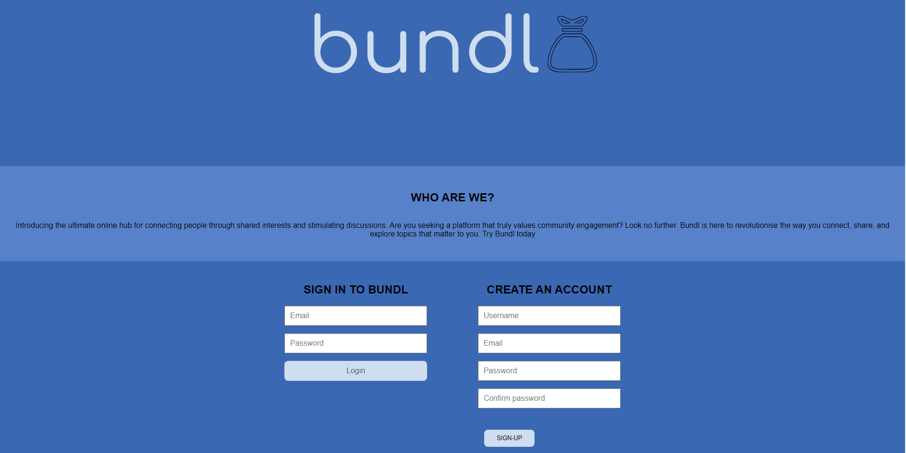

# hacker-society// Bundl

# Description of project
The Bundl app is a full-stack interactive webpage which includes frontend and backend functionalities.

The team's idea was to build an interactive social app that involves users sharing thoughts and making connections with mindful discussions from their perspective and discovering and following/subscribing to as many topics as possible through posts and forums. 

To interact within the Bundl webpage is to first, create a profile/account with an username,email and password and this then will take you to the homepage of the account where you are breifed with options including clicking onto the user's current profile to look back at the user's previous posts and making a new 'bundl' or 'sub-bundl' which will allow the user to open up a topic that they have expressed within the application and post it within their own accord.

The inspiration behind building Bundl was to make an user-friendly social webpage where people can share their thoughts/opinions without no backlash. Similar to Reddit in many ways except the idea implemented within Bundl was to avoid the controversies that they faced such as the communities within the app expressing hate/violent speeches and providing misinformation. The team's main aim was to prioritise user engagement and discussions that can help the masses with questions/enquiries that they have without any adversities.

# User story

- AS A User
- I WANT to be able to create a profile
- SO THAT they are able to create a bundl and they see what they just posted on their page or forum

# Acceptance criteria

- GIVEN the user has already made an account on Bundl and already made various posts,discussions or topics
- WHEN they click on their profile/profile pic 
- THEN they should be able to see the topics that they have discussed or shared recently on the page with others

# Project features

# Project implentations

# Screenshot of website

# Links
Link to deployed application:
Link to GitHub Repository:

# Licence
N/A

# Contributors
Bundl's team contributors:

- (https://github.com/JackStockwell)
- (https://github.com/ahs456)
- (https://github.com/AJosueBN)
- (https://github.com/ThinkPad2023)